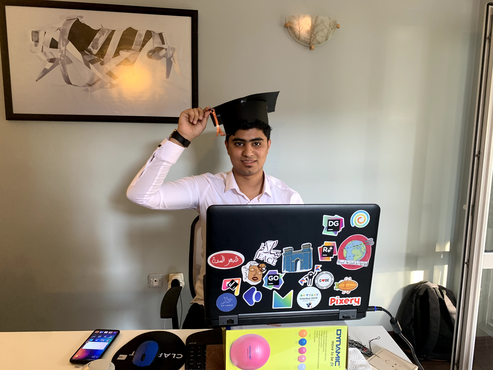
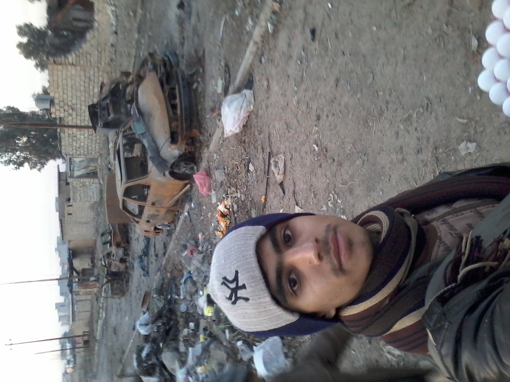
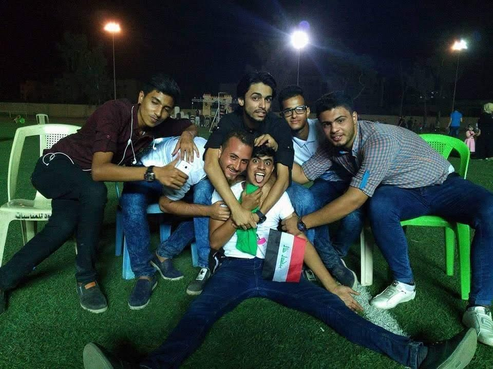
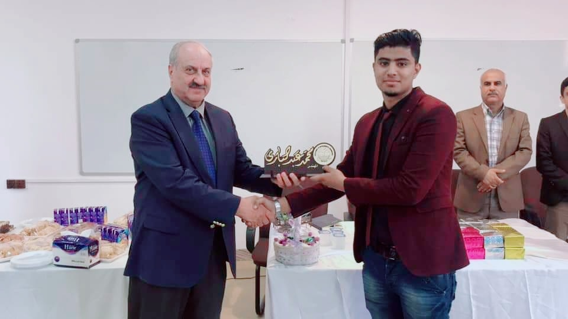
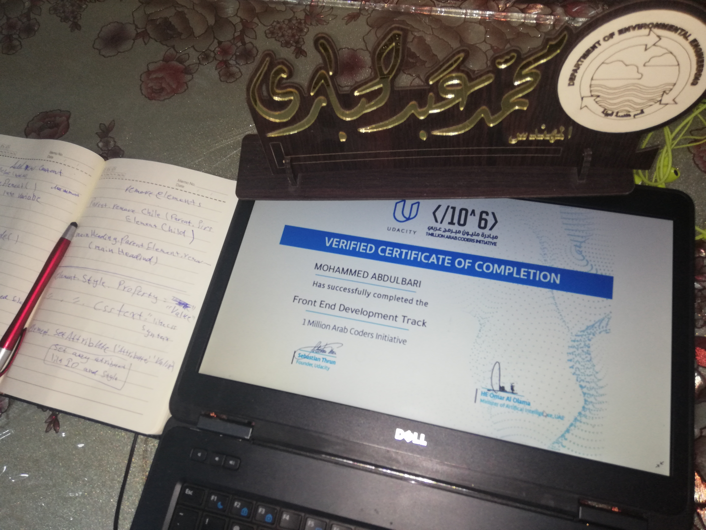
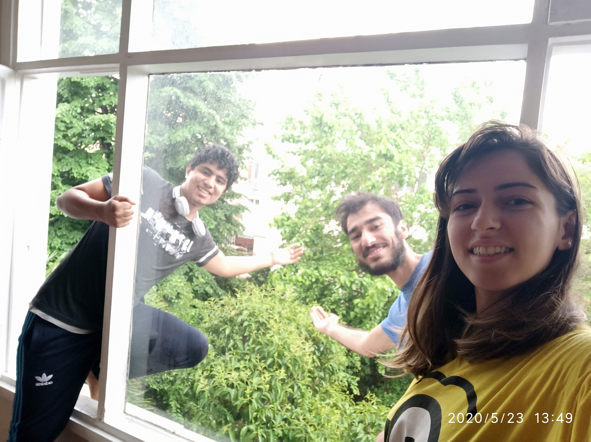
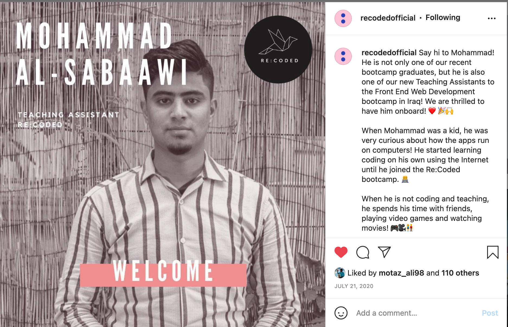
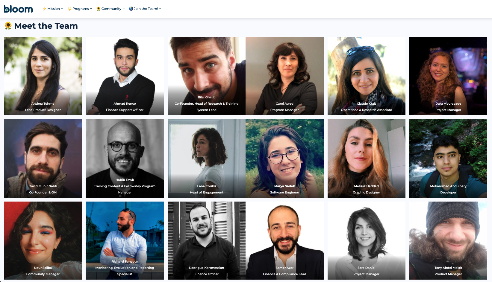

# coding-journey

# رحلتي ويا البرمجة وشلون كدرت اغير حياتي من خلال فرصة تكلف ١٠ آلاف دينار باليوم:

### يابه سلام عليكم ✋ اول شي خلي اسولفلكم عن نفسي:
اني محمد عراقي من مدينة الموصل، عمري ٢٥ سنة.
 حاليا اشتغل ك full stack developer مع منظمة لبنانية تخبل اسمها Bloom وصارلي اشتغل وياهم تقريبا ١٣ شهر 😁

 ### زين شلون وصلت لهذي المرحلة وشلون بدت قصتي ويا البرمجة؟
القصة بدأت قبل سنتين. بس قبل ما ادخل بقصة السنتين، خل نرجع شوية ليورا.
 اني جنت عايش وسط احداث داعش وسيطرتهم على الموصل والحرب، عشتها مدة ٣ سنوات جانت من أصعب سنوات حياتي. 

بس دائما يگولون "دوام الحال من المحال" فلازم راح يجي يوم وتتغير بي هذي الوضعية!
وفعلا جا هذا اليوم وتحررنا  من داعش ببداية والحرب انتهت بنهاية سنة ٢٠١٧!

 ### دراسة الجامعة بعد تحرير الموصل 

 

بعد طول انتظار بعد٣ سنوات بدت حياتي الجامعية، رغبتي كانت دراسة هندسة كهرباء او ميكاترونك ولكن..
دخلت هندسة بيئة
درست اول سنة وكنت سعيد بيها. بالمرحلة الثانية بديت ما استمتع بهذا القسم وهاي الكلية بسبب مشاكل القسم. طاقتي بالدراسة وبالدوام بدت تقل وبمرور الوقت بديت اتأكد انو اني ما اريد اكمل بهذا القسم. بديت اضوج من مشاكل النظام الجامعي والتدريس التقليدي.

جنت اشوف عندي طاقات مال ابداع بالدراسة مداكدر استغلها بسبب النظام التعليمي هذا وجان هذا الشي يخليني احس بالحزن على الوقت الي دا يضيع (خلال هذه السنوات معرفتي بالبرمجة كانت مقتصرة على المادة البسيطة الي تعلمتها بالاعدادية عن الـ Visual Basic)

ولكن بعد تفكير كثير انو شلون احسن هذا الوضع قررت انو بس اخلص الكلية اخذ اسبوع استراحة وبعدها ابدي اتعلم برمجة😍
البرمجة الي كانت دائما حلمي، لمن كنت كلش صغير وهذا الحب للكمبيوتر بدا يكبر وبوقتها بديت اتمنى اتعلم احجي ويا الحاسبة واكتب أوامر وهي تجاوبني. حب البرمجة هو جانب موجود عندي من الصغر ويكبر خلال السنوات لكن اني ابد ما طورته.

لكن بعد مخلصت سنة ثانية وبعد القرار الي اخذتة، بديت اتعلم برمجة فعلا!

 ### بداية رحلة البرمجة 
زين شلون ابدي؟ ومن وين اتعلم؟ ووين اروح؟ 
هاي الاسئلة الي الكل يتسائلها لمن يريد يبدي فد شي.
اني بديت ب ++C لان عندي صديق تخصصه تربية قسم حاسبات وهاي هي لغته المفضلة. و بعد شهر تقريبا كدرت اتعلم شوية عن هذي اللغة واگدر اسوي اشياء بسيطة بيها.

هنا بدا التغيير الاولي!

 وكانت بداية تغيير كل شي لاحق بعد ما شفت فيديو ناشرينة منظمة موصل سبيس على صفحتهم
عن مبرمج عراقي يشتغل بفيسبوك اسمه مرتضى التميمي.
الفيديو كان يحجي على منحة بيها سفر على تركيا لمدة ٥ أشهر تتضمن دراسة ب معكسر برمجي مختص ببرمجة واجهة المواقع الإلكترونية (frontend web bootcamp).
اول شي سويته بعد ما شفت الفيديو مليت الاستمارة وبعدها بديت اكمل المراحل الثانية مال تقديم على هذي المنحة.
وبالنهاية اجاني خبر القبول!
جان لازم اسافر واترك كليتي واروح ابدي من الصفر بدولة جديدة، وكانت اول مرة اسافر بحياتي حتى جواز ماعندي. ما كان سهل اتخاذ القرار انو اترك كليتي حت اركض ورا حلمي بانو اصير مبرمج، لكن احساسي الداخلي كان يگولي انو هاي هي فرصة العمر الي مو لازم اضيعها.

### بداية الحياة بتركيا
اول ما وصلت تركيا التقيت بناس ما راح انسانهم كل حياتي. التقيت بمجتبى التميمي (اخ مرتضى التميمي) و زوجته مينا و عشت ببيتهم فترة تعلمت منهم اشياء ساعدتني اتغير بشكل كامل على كل مستويات حياتي.

ومن ذاك الوقت عرفت بهذي السفرة مراح تكون البرمجة هي الشي الوحيد الي اتعلمه. خلال هذي السفرة اتعلمت كمية كبيرة عن البرمجة  خلتني اصير مبرمج ووصلتني للمكان الي اني بي حاليا. لكن هذا القدر الكبير من التعلم ما كان الا ١٠٪ من بقية الأشياء القيمة الأخرى الي تعلمتها.

تعلمت وطورت هواية مهارات حياتية ما كنت انطيها اي اهتمام. هذي المهارات هي احد الاسباب الرئيسية الي خلتني الكة شغل! تعلمت شلون اتواصل بشكل احسن، وشلون يكون عندي شخصية قيادية، وشلون ما احكم على الناس من شكلهم او من موقف صار، وشلون افكر بشكل إبداعي، وشلون اتسائل عن كل شي حولي، وشلون اتغلب على خوفي و اجرب اشياء جديدة كنت خايف انو اجربها، وغيرها من مهارات ثمينة غيرت حياتي للأفضل

تعلمت انو هذي الحياة هي مو لعبة فردية وحتى ننجح بيها لازم نلكي ناس يساعدونا و بالمقابل احنا هم نساعد غيرنا من الناس.

السفر وحدة يعلم الإنسان هواية اشياء و يخليه يعتمد على نفسه و يشوف الحياة بمنظور جديد كليا. كانت هذي السفرة الي بمثابة انو اني غيرت عيوني وشديت عيون جديدة اشوف بيها العالم من حولي بطريقة مختلفة جدا واجمل بهواية.

المعسكر البرمجي استمر لخمس أشهر، وكان عدنا ٣ إيام من المحاضرات بالأسبوع. كانت اكو هواية تحديات وصعوبات لكن كنت جدا مستمتع بيهم.

 قبل انتهاء المعسكر حصلت عرض عمل من نفس المعهد الي اني طالب عدهم [Re:coded](https://re-coded.com/), بديت اشتغل و صرت استاذ مساعد بمعسكر برمجي لطلاب العراق من الموصل وأربيل. كانت هذي من أجمل لحظات حياتي!
 
 

وبعد ما انتهى المعسكر التدريبي، حصلت وظيفة ثانية مع منظمة اسمها Bloom الي مازالت مكان شغلي الى الان. شركة رائعة محظوظ جدا بحصولي على شغل وياهم

 

### شلون تكدر تسوي مثل ما اني سويت (حتى بدون منحة)؟
اني لمن كنت بالعراق و قبل لا اسافر كنت اتخيل تكلفة السفر جدا عالية، و كنت دائما أخاف من السفر، و هاي الحالة موجودة عند الكل تقريبا بمجتمعنا، لكن تعالو خلي نحسب التكاليف ونقرر بعدها، 
#### التكاليف مال العيش بمدينة اسطنبول بتركيا:

1. السكن: السكن اسعاره متفاوتة جدا وتعتمد على المنطقة. بس بكل سهولة تگدر تاجر غرفة مع غير ناس وتطلع عليك اجار الغرفة بأقل من 100$ بالشهر. وممكن اصلا تلگي ارخص إذا تدور سكن طلابي داخلي او شقق بعيدة عن مركز اسطنبول، يجوز توصل حتى 75$.

2. الاكل: الاكل هنا مثل أسعار العراق تقريبا. اذا راح تعتمد على المطاعم فراح يطلع المبلغ كبير. بس اذا انت تطبخ بالبيت وتروح تشتري اشياء مثل خضار وفاكهه وبقوليات، تگدر تغطي الاكل تقريبا بـ100$ شهريا

3. المواصلات: التكسيات بتركيا وبدول العالم اغلبها غاليين اسعارهم. البديل عنهم متوفر وسهل وجدا مريح (خصوصا باسطنبول). تكدر تروح من أي مكان لأي مكان حرفيا بالمواصلات العامة وهذي تكلفتها قليلة وتگدر تمشي حالك بين 20$ - 30$ بالشهر.

يعني المجموع راح يكون تقريبا 200$ - 220$ او شوية اكثر، يعني بالعراقي تقريبا ٣٠٠ الف (بوقتي كان الدينار شويه اقوى).

اذا نقسم ٣٠٠ الف دينار عراقي على ٣٠ يوم (شهر واحد) يعني باليوم كنت احتاج ١٠ آلاف دينار. وبعد ٥ أو ٦ أشهر حصلت اول شغل وكنت استلم راتب تقريبا 500$ بالشهر.

الموضوع ابدا ما صعب ولا مستحيل و ما يحتاج جهات خارجية تدعمه. اي واحد يكدر يسويه بنفسه او يساعد احد ثاني و يقدم له هيج فرصة.

مثل ما هذولة الناس الخرافيين سوو هذا الشي وياية و ويا شباب غيري حتى يساعدهم ويطورهم.
 
### الخاتمة
هواية ناس تصرف آلاف الدولارات على دورات خصوصية بالسادس و على واسطة حتى يحصل تعيين و بالاخير راح يستلم راتب ثابت و قليل جدا. 
بينما اذا تريد تستثمر بنفسك و تحاول تتعلم مهارات جديدة راح تحتاج هواية اقل من الفلوس الي تصرفها على الدروس الخصوصية و الواسطة! 
والنتيجة انه خلال أقل من سنة ممكن تحصل شغل و بعد هذا خلال سنة و نص تكدر تخلي راتبك يوصل اكثر من راتب طبيب صارله سنتين متعين بالمستشفى 😁

